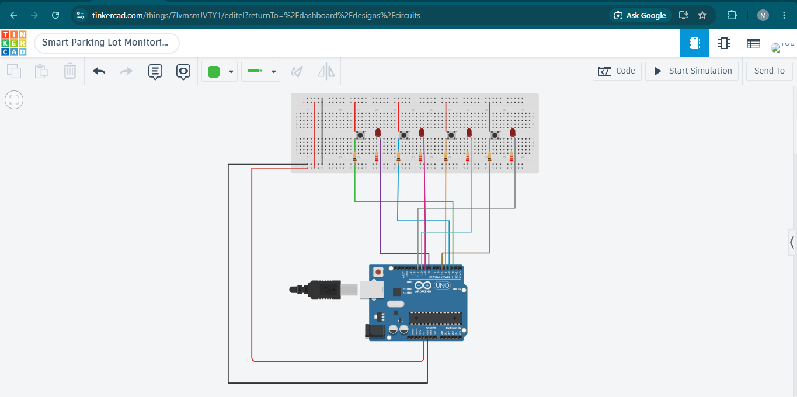
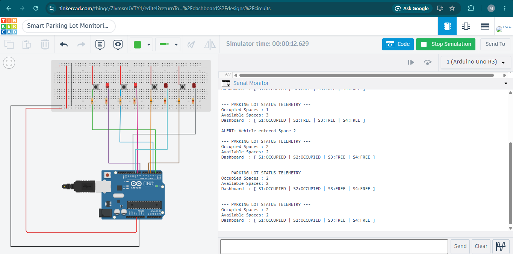
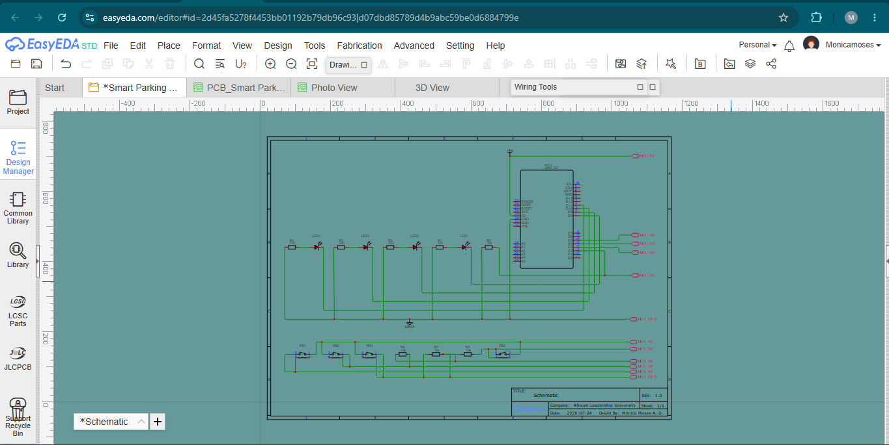
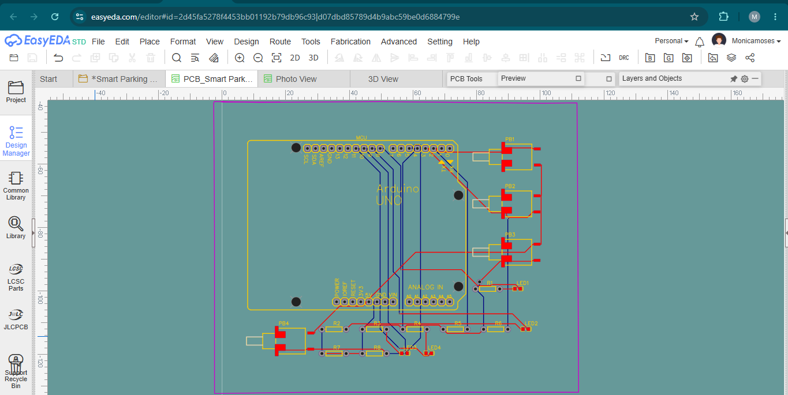
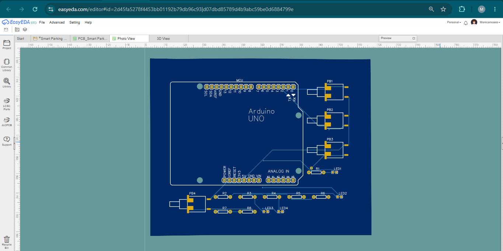
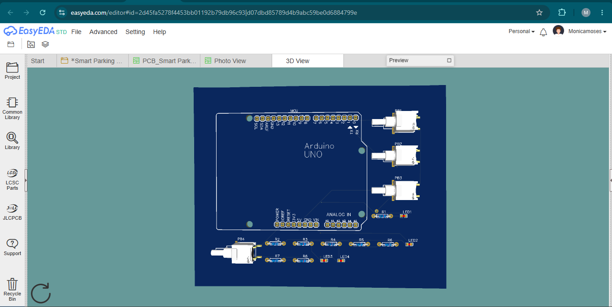
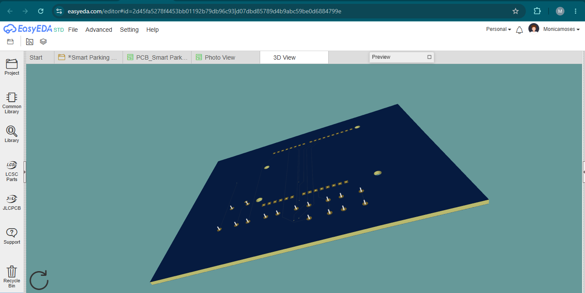

# Project 1: Smart Parking Lot Monitoring System

## Overview

This project is a smart parking lot monitoring system simulated in Tinkercad.

The system monitors four parking spaces. Each parking space is represented by an LED, while push buttons are used to simulate vehicle entry and departure.

When a parking space is occupied, its LED turns on. When the vehicle leaves, the LED turns off. The system also keeps track of the total number of occupied and available parking spaces.

Parking information is displayed through the Arduino Serial Monitor.

## Features

- Monitors four parking spaces
- Uses four LEDs to display parking status
- Uses push buttons to simulate vehicle entry and departure
- Tracks occupied spaces
- Tracks available spaces
- Prevents the parking count from going above the maximum capacity
- Prevents the parking count from becoming negative
- Uses structures to organize parking information
- Uses dynamic memory to store the parking spaces
- Uses pointers to access parking records
- Uses `millis()` for non-blocking status updates
- Displays parking information through the Serial Monitor
- Includes basic error handling
- Includes an EasyEDA schematic
- Includes an EasyEDA PCB layout

## Technologies Used

- Tinkercad
- EasyEDA
- C/C++ for Arduino

## Arduino Code

The Arduino program is stored in:

```text
smart_parking.ino
```

The program uses a `ParkingSpace` structure to store the following information for each parking space:

- Parking space ID
- Push-button pin
- LED pin
- Occupancy status
- Previous button state

The parking spaces are created dynamically using:

```cpp
parkingLot = new ParkingSpace[TOTAL_SPACES];
```

Pointers are used to access each parking space:

```cpp
ParkingSpace* space = parkingLot + i;
```

The system uses `millis()` to update the parking status without stopping the rest of the program:

```cpp
if (currentMillis - lastDisplayTime >= DISPLAY_INTERVAL) {
    lastDisplayTime = currentMillis;
    printParkingStatus();
}
```

## Circuit Simulation



The circuit contains Arduino Uno, four push buttons, four LEDs, current-limiting resistors, breadboard, and connecting wires

Each push button controls one parking space. Pressing a button changes the parking space between available and occupied.

## Serial Monitor Output



The Serial Monitor displays: number of occupied spaces, number of available spaces, status of each parking space, vehicle entry events, vehicle departure events, error messages for invalid parking operations.

## EasyEDA Schematic



The schematic shows the connections between: Arduino controller, push buttons, LEDs, resistors, power and ground connections.

## EasyEDA PCB Layout



The PCB layout was created from the schematic and organizes the components and electrical connections on the board.

## PCB in photo view


## PCB in 3D view



## How to Run

1. Open the Arduino code in Tinkercad or Arduino IDE.
2. Connect the LEDs and push buttons according to the circuit design.
3. Start the simulation.
4. Open the Serial Monitor.
5. Press a push button to change the status of its parking space.
6. Observe the LED and Serial Monitor updates.

