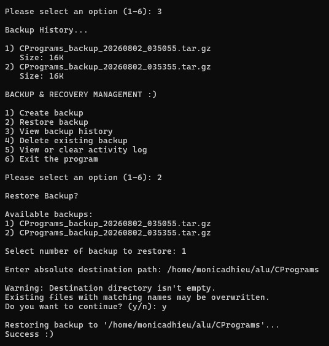

# Project 2: Backup and Recovery Management System

## Overview

This project is a menu-driven Backup and Recovery Management System.

The program allows users to create backups, view saved backup records, restore backed-up files, and manage backup information. It uses file handling to save and retrieve data and includes input validation and error handling.

The project is organized into separate files to keep the program clear and modular.

## Features

- Create file backups
- View available backup records
- Restore backed-up files
- Manage backup information
- Save backup data to files
- Load saved backup information
- Validate user input
- Handle invalid file names
- Handle missing files
- Handle file errors
- Use a menu-driven interface
- Organize the program using modular functions

## Concepts Used

- File handling
- Structures
- Dynamic memory
- Backup operations
- Recovery operations
- Input validation
- Error handling

## Error Handling

The program handles common errors, including:

- Invalid menu choices
- Invalid user input
- Missing source files
- Missing backup files
- File opening errors
- File reading errors
- File writing errors
- Memory allocation errors

## How to Run

```bash
./backup.sh
```

## Sample Run


