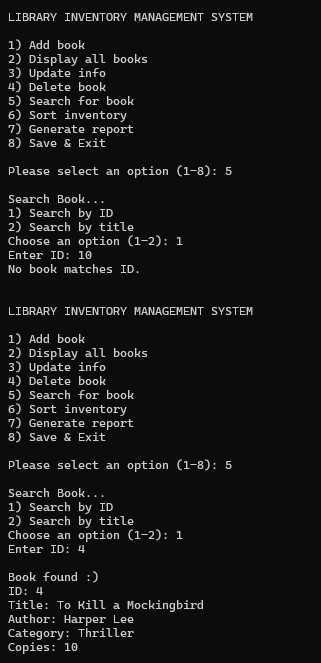

# Project 3: Library Book Inventory Management System

## Overview

This project is a menu-driven Library Book Inventory Management System.

The program stores book records dynamically in memory and saves them to a text file. Users can add, display, update, delete, search, and sort books. The program can also generate inventory reports.

## Features

- Add a new book
- Display all books
- Update book information
- Delete a book
- Search by book ID/title
- Sort by book ID/title/available copies
- Generate inventory reports
- Prevent duplicate book IDs
- Validate user input
- Prevent negative book IDs or copy values
- Save records to a text file
- Load records from a text file
- Use dynamic memory allocation
- Handle memory allocation errors
- Handle file errors

## Book Information

Each book contains:

- Book ID
- Title
- Author
- Category
- Number of available copies

The book information is stored using a structure.

## File Descriptions

`main.c` is the entry point of the program.

`library.h` contains the book structure and function declarations used by the program.

`library.c` contains dynamic memory management, file loading and saving, (add, display, update, and delete) operations, search functions, sorting functions, inventory reports, input validation, main program menu

`inventory.txt` stores the book records so they can be loaded when the program starts again.

## Dynamic Memory

The program stores books in a dynamically allocated array.

Memory is allocated using:

```c
malloc()
```

The array grows using:

```c
realloc()
```

The allocated memory is released using:

```c
free()
```

The program increases its capacity when the current array becomes full.

## Compilation

```bash
gcc main.c library.c -o library
```

## Running the Program

```bash
./library
```

## Sample Run


