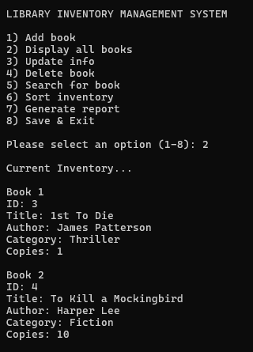

# Project 4: Unit Conversion Toolkit Using Function Pointers

## Overview

This project is a menu-driven Unit Conversion Toolkit.

The program performs different unit conversions using function pointers. Each conversion is saved in a dynamically allocated history. Users can view, search, sort, process, save, and load conversion records.

## Features

- Perform unit conversions
- Store conversion records dynamically
- View conversion history
- Search by conversion type
- Search by converted value
- Sort by conversion type
- Sort by converted value
- Change the precision of stored output values
- Filter records using a user-defined value
- Save conversion history to a text file
- Load conversion history from a text file
- Validate user input
- Handle file errors
- Handle memory allocation errors

## Supported Conversions

The program supports eight conversions:

1. Celsius to Fahrenheit
2. Fahrenheit to Celsius
3. Kilometres to miles
4. Miles to kilometres
5. Kilograms to pounds
6. Pounds to kilograms
7. Centimetres to inches
8. Inches to centimetres

## File Descriptions

`main.c` is the entry point of the program.

`calculator.h` contains the ConversionRecord structure, function pointer definitions, callback definitions, and function declarations.

`calculator.c` contains conversion functions, dynamic history management, search operations, sorting operations, callback operations, file saving and loading, input validation, and main program menu.

`history.txt` stores conversion records so they can be loaded later.

## Function Pointers

The program stores the conversion functions in an array of function pointers.

```c
ConversionFunction conversions[8] = {
    c_to_f,
    f_to_c,
    km_to_mi,
    mi_to_km,
    kg_to_lb,
    lb_to_kg,
    cm_to_in,
    in_to_cm
};
```

The selected conversion is called using:

```c
output = conversions[choice - 1](input);
```

This allows the program to choose the correct conversion function at runtime.

## Callback Functions

Callback functions are used to process conversion records.

The program uses callbacks to:

- Compare conversion types during sorting
- Compare converted values during sorting
- Change the precision of output values
- Filter records based on a value entered by the user

## Dynamic Memory

Conversion records are stored in a dynamically allocated array.

The program uses:

```c
realloc()
```

to increase the size of the history when more space is needed.

The memory is released using:

```c
free()
```

when the program exits.

## Compilation

```bash
gcc main.c calculator.c -o calculator -lm
```

The `-lm` option is required because the program uses functions from the math library.

## Running the Program

```bash
./calculator
```
## Sample Run


