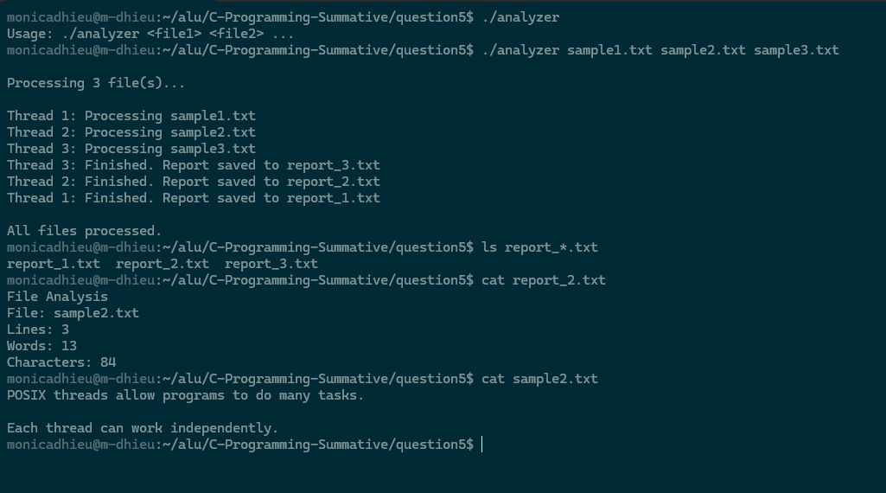

# Project 5: Multi-threaded File Processing System

## Overview

This project is a multi-threaded file processing system using POSIX threads.

The program processes multiple text files concurrently. Each input file is assigned to its own thread.

Every thread counts:

- Number of lines
- Number of words
- Number of characters

The result for each input file is saved in a separate output file.

## Features

- Uses POSIX threads
- Processes multiple files concurrently
- Assigns one thread to each input file
- Counts lines
- Counts words
- Counts characters
- Creates a separate report for every file
- Displays the status of each thread
- Handles missing input files
- Handles invalid file names
- Uses dynamic memory
- Uses command-line arguments
- Organizes the program into separate files

## File Descriptions

`main.c` is the main program. It:

- Reads input file names from the command line
- Creates one thread for each file
- Waits for all threads to finish
- Releases dynamically allocated memory

`analyzer.h` contains the ThreadArgs structure and the thread function declaration

`analyzer.c` contains the thread function that:

- Opens the input file
- Counts lines
- Counts words
- Counts characters
- Creates an output report
- Displays the processing status

## How the Program Works

If files are provided eg:

```bash
./analyzer sample1.txt sample2.txt sample3.txt
```

the program creates three threads.

```text
Thread 1 → sample1.txt
Thread 2 → sample2.txt
Thread 3 → sample3.txt
```

Each thread processes its file independently.

No thread synchronization is required because each thread works with a separate input file and creates a separate output file.

## Compilation

```bash
gcc main.c analyzer.c -o analyzer -pthread
```

## Running the Program

Run with one or more text files:

```bash
./analyzer sample1.txt sample2.txt sample3.txt
```

## Example Output

```text
Processing 3 file(s)...

Thread 1: Processing sample1.txt
Thread 2: Processing sample2.txt
Thread 3: Processing sample3.txt

All files processed.
```

The program creates a separate report for each file.

## Missing File Handling

If a file does not exist, the related thread displays an error message while the other files continue processing.

Example:

```text
Thread 2: Could not open missing.txt
```

## Sample Run


